# cupel 

> _separates precious LLMs from base LLMs_

score local and cloud LLMs with custom prompts and a configurable judge

  

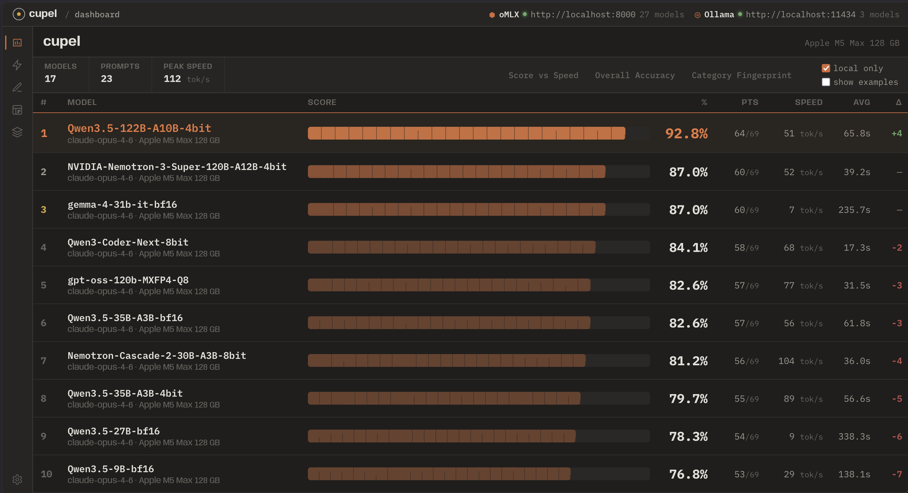

###### _a `cupel` is the small dish used in a fire assay to separate precious metal from base metal_

## install

```bash
pip install cupel
```

the UI is bundled in the package

## quick start

```bash
cupel
```

opens a browser at `localhost:8042`

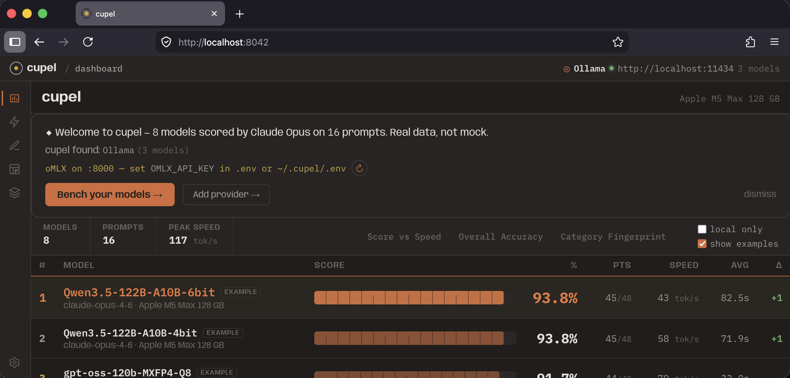

ships with example data (8 models scored by Claude Opus 4.6 on 8 prompts) — the dashboard is populated on first launch

- **LLM-assisted authoring** — describe what you want to test, an LLM drafts the prompt and 0–3 rubric
- **local + cloud** — oMLX, Ollama, LM Studio, SGLang, OpenRouter, Anthropic, OpenAI
- **configurable judge** — any model can score responses on a 0–3 rubric with reasoning
- **thinking model support** — separates `<think>` blocks from answers, only judges the response
- **multi-turn + tool calling** — multi-step conversations with injected tool results
- **speed tracking** — tok/s and response times per model
- **auto-discovery** — probes known ports for local inference servers

## leaderboard

leaderboard with score vs. speed, overall accuracy, and per-category breakdowns

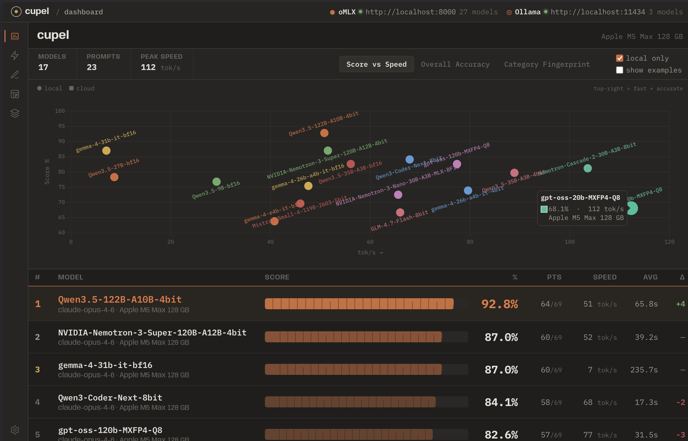 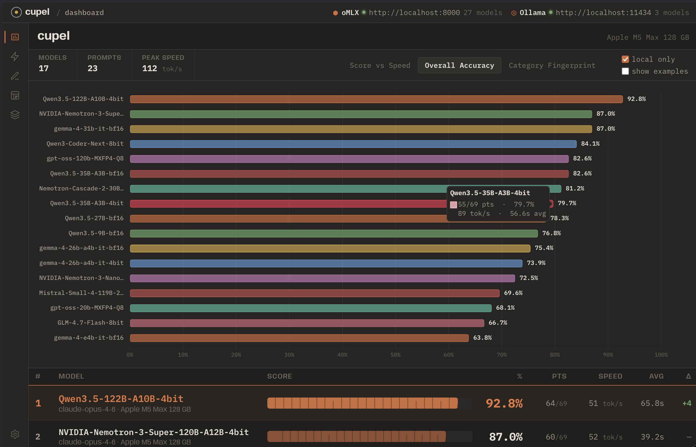

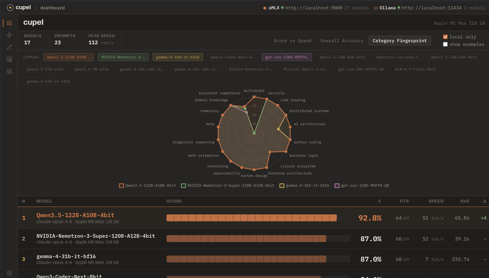

## score models

select models from discovered providers, filter by prompt category, choose a judge model, and start the run

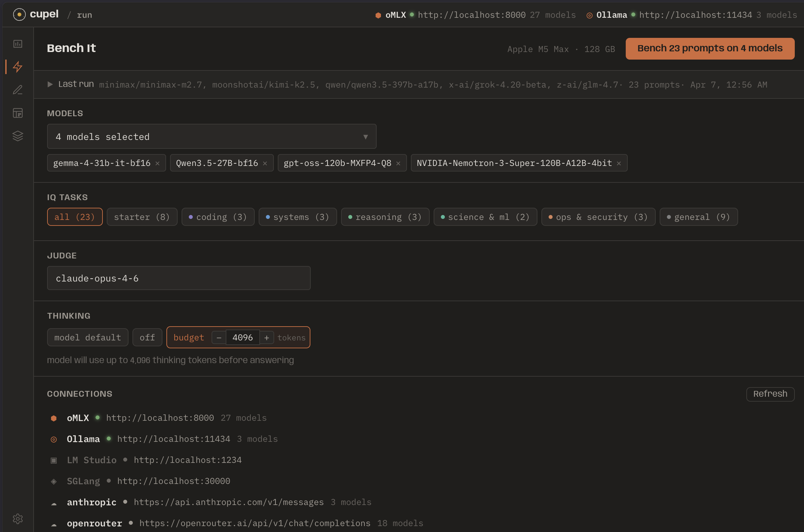

progress updates via SSE as each prompt completes

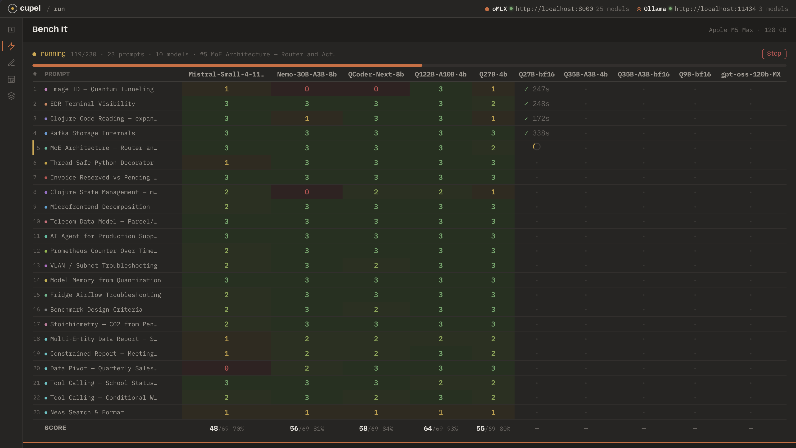

## author prompts

describe what to test, select a category and difficulty — an LLM generates the title, prompt text, and 0–3 rubric. edit before saving

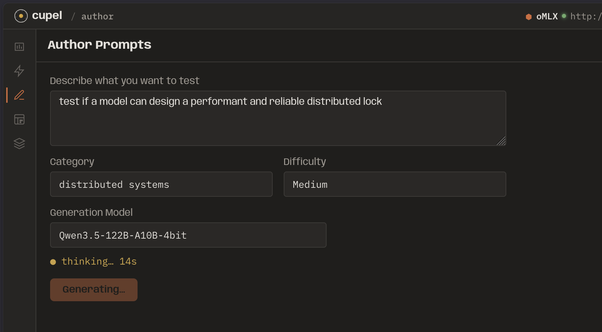 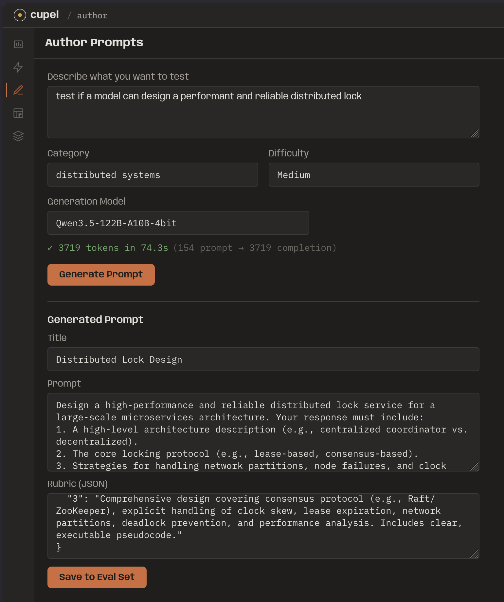

## results

each run is saved as JSON with the model, judge, timestamp, and per-prompt scores with judge reasoning<br/>
results can be sorted, tagged, muted and expanded to inspect individual evaluations

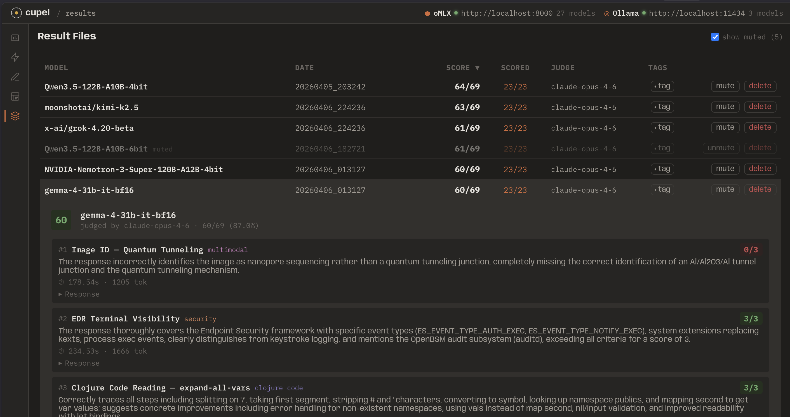

## judge

set a default judge in UI settings or in `config.yml`:

```yaml
judge:
  model: claude-opus-4-6
```

scores are 0–3:

| score | meaning |
|-------|---------|
| 3 | correct and insightful |
| 2 | correct but shallow |
| 1 | partially correct |
| 0 | wrong or hallucinated |

## prompt format

```json
{
  "id": 14,
  "category": "math_estimation",
  "title": "Model Memory from Quantization",
  "prompt": "A model has 70B parameters. Estimate memory for FP16, 8-bit, and 4-bit.",
  "rubric": {
    "3": "FP16: ~140GB, 8-bit: ~70GB, 4-bit: ~35GB. Shows the math.",
    "2": "Correct for 2 of 3, or all correct but no explanation.",
    "1": "Gets the direction right but wrong numbers.",
    "0": "Wrong math or doesn't understand quantization."
  }
}
```

### multi-turn prompts

for tool calling and conversations, use `turns` instead of `prompt`:

```json
{
  "id": 21,
  "title": "Tool Calling — School Status Check",
  "turns": [
    {
      "messages": [
        {"role": "system", "content": "You have tools: get_grades(name), ..."},
        {"role": "user", "content": "How are both kids doing?"}
      ]
    },
    {
      "inject_after": [
        {"role": "user", "content": "Tool results: get_grades(\"phoebe\") => ..."}
      ]
    }
  ],
  "rubric": { "3": "Emits correct tool calls, synthesizes results...", "..." : "..." }
}
```

### thinking models

cupel handles `<think>` blocks automatically — separates thinking from the answer, only judges the response:

```yaml
thinking: null   # model default (recommended)
thinking: 0      # disable
thinking: 4096   # explicit budget
```

## providers

cloud providers can be added from presets (Anthropic, OpenRouter, OpenAI) or as custom endpoints. the settings page fetches model lists from a provider's API (includes per-token pricing for OpenRouter), validates API keys, and tests connections

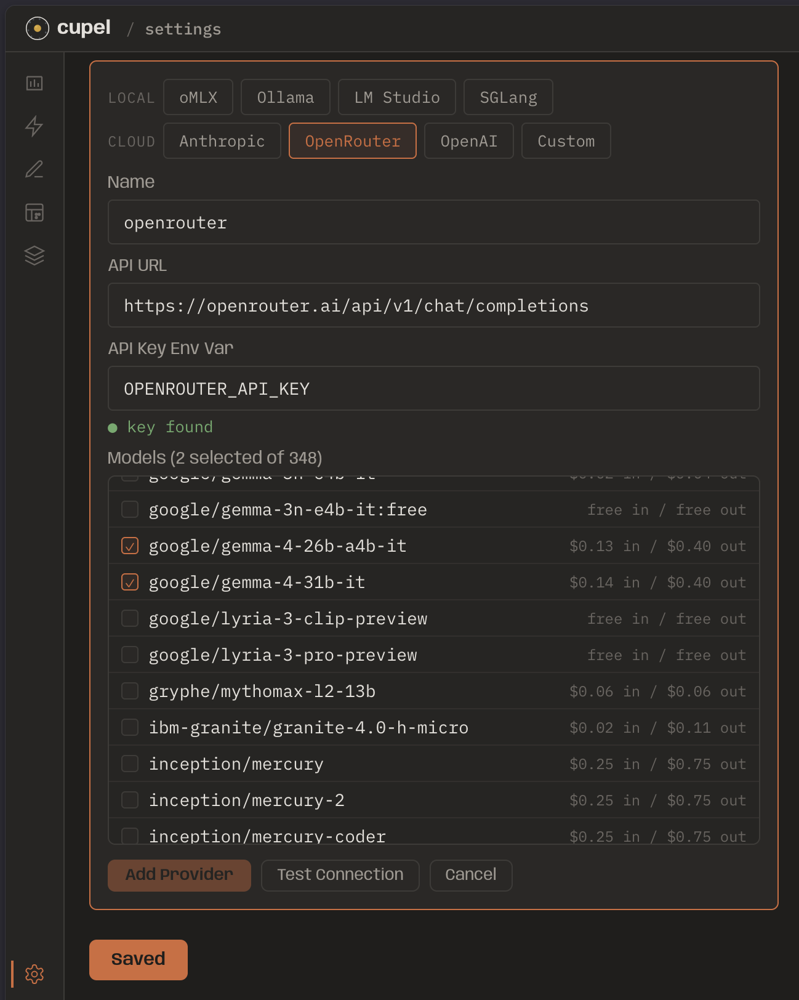

cupel auto-discovers local servers on known ports:

| port | server |
|------|--------|
| 8000 | oMLX / vLLM |
| 11434 | Ollama |
| 1234 | LM Studio |
| 30000 | SGLang |
| 8080 | llama.cpp |

### API keys

each provider gets its own env var. put them in `.env` or `~/.cupel/.env`:

```bash
OMLX_API_KEY=4242
ANTHROPIC_API_KEY=sk-ant-...
OPENROUTER_API_KEY=sk-or-...
OPENAI_API_KEY=sk-proj-...
```

or configure in `config.yml`:

```yaml
providers:
  - name: openrouter
    api_url: https://openrouter.ai/api/v1/chat/completions
    api_key_env: OPENROUTER_API_KEY
    models: [google/gemini-2.5-pro, deepseek/deepseek-r1]

  - name: anthropic
    api_url: https://api.anthropic.com/v1/messages
    api_key_env: ANTHROPIC_API_KEY
    models: [claude-opus-4-6, claude-sonnet-4-6]
```

## CLI

```bash
cupel                                  # open dashboard
cupel run                              # collect responses
cupel run --models "Qwen3.5-27B-8bit"  # specific model
cupel run --prompts 18-22              # specific prompts
cupel judge eval-results/*.json        # score with judge
cupel judge eval-results/*.json --judge-model gemma-4-26b-a4b-it-4bit
cupel init                             # create config.yml + eval-set
```

## development

```bash
git clone https://github.com/tolitius/cupel.git && cd cupel
pip install -e .
uvicorn cupel.server:app --reload --port 8042
```

vanilla JS frontend (Preact + HTM from CDN). no build step.

## license

Copyright © 2026 tolitius

Distributed under the [Apache 2.0](LICENSE) License.
